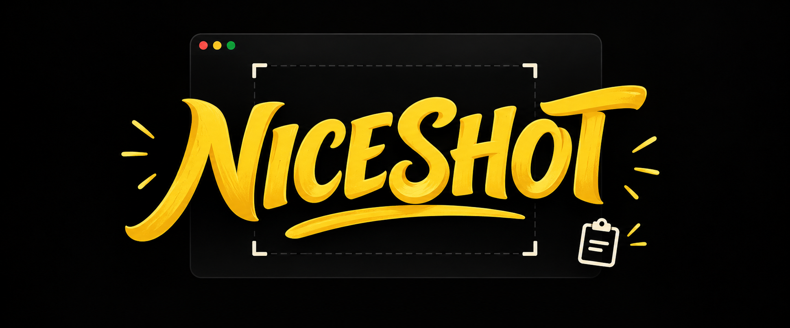

<p align="center">
  
</p>

<p align="center">
  <strong>让 Caps Lock 成为截图层；单独轻点仍是正常 Caps Lock。</strong>
</p>

<p align="center">
  <a href="README.md">English</a> · 简体中文 · <a href="README.ja.md">日本語</a>
</p>

```text
 _   _ ___ ____ _____ ____  _   _  ___ _____
| \ | |_ _/ ___| ____/ ___|| | | |/ _ \_   _|
|  \| || | |   |  _| \___ \| |_| | | | || |
| |\  || | |___| |___ ___) |  _  | |_| || |
|_| \_|___\____|_____|____/|_| |_|\___/ |_|

              CAPS LOCK → 截图层
```

NiceShot 是一套完全免费的开源 macOS 截图工作流，只使用系统自带 `/usr/sbin/screencapture`、AppleScript 和 Karabiner-Elements。它不安装第三方截图应用，不弹保存窗口，不自动打开预览，也不会上传任何内容。

## 核心逻辑

不加 Shift 表示临时信息，截图只进入剪贴板。加 Shift 表示明确保存：生成最终 PNG，同时把同一张图片放进剪贴板。

| 快捷键 | 截图类型 | 结果 |
|---|---|---|
| `Caps + S` | 区域 | 仅剪贴板 |
| `Caps + W` | 窗口、无阴影 | 仅剪贴板 |
| `Caps + F` | 全屏 | 仅剪贴板 |
| `Caps + Shift + S` | 区域 | PNG + 剪贴板 |
| `Caps + Shift + W` | 窗口、无阴影 | PNG + 剪贴板 |
| `Caps + Shift + F` | 全屏 | PNG + 剪贴板 |

单独轻点 `Caps Lock` 仍执行正常 Caps Lock。

## 环境要求

- macOS
- 免费开源的 [Karabiner-Elements](https://karabiner-elements.pqrs.org/)
- macOS 自带的 `screencapture`、`osascript` 和 Ruby

## 安装

1. 安装并打开 Karabiner-Elements。
2. 按照 Karabiner 引导手动允许：
   - 两项 Karabiner 后台活动
   - `Karabiner-Core-Service` 的辅助功能权限
   - Karabiner 虚拟 HID 驱动扩展
   - `Karabiner-Console-User-Server` 的录屏与系统录音权限
3. 执行：

```zsh
chmod +x install.sh uninstall.sh
./install.sh
```

默认保存目录：

```text
~/Pictures/Screenshotschichu
```

也可以在安装时指定其他目录：

```zsh
NICESHOT_SAVE_DIR="$HOME/Pictures/NiceShot" ./install.sh
```

安装器会检查现有配置、创建带时间戳的备份，并且只向当前配置追加一条 NiceShot 规则。已有规则不会被覆盖；重复运行也不会产生重复规则。

## 验证

1. `Caps + S` 框选后粘贴，确认图片立即可用，并且 Desktop、Downloads、Pictures 没有新增截图。
2. `Caps + W` 点击一个窗口并粘贴，确认窗口没有阴影。
3. `Caps + Shift + S` 框选后确认：
   - 图片可以立即粘贴；
   - 保存目录出现 `Screenshot-YYYY-MM-DD-HH.MM.SS.png`。

## 卸载

```zsh
./uninstall.sh
```

卸载器只移除描述为 `NiceShot: Caps Lock Screenshot Layer` 的规则，执行前会备份配置，也不会删除已经保存的截图。

## 隐私与约束

- 不需要任何付费截图软件
- 剪贴板截图不生成临时 PNG
- 不上传云端，不含遥测
- 不自动打开预览
- 不自动写入桌面或下载目录
- 不修改 SIP、Gatekeeper 或系统安全策略
- 窗口截图默认不带阴影

## 许可证

MIT

